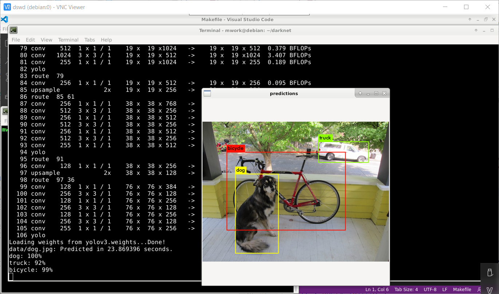

# Không dùng vì không có GPU tốc độ 23(S) một hình



# install và loi

```
pip3 install requests # Used to download darknet
pip3 install cython
pip3 install numpy
pip3 install yolo34py-gpu
```

```
git clone --depth=1 https://github.com/pjreddie/darknet
cd darknet

edit makefile
GPU=0 # Có dùng Nvidia GPU? Có là nhanh đáng kể đó
CUDNN=0 # Có tích hợp Cuda NeuralNetwork không
OPENCV=0 # Có tích hợp OpenCV không? có là thêm nhiều trò hay lắm
OPENMP=0 # Có tích hợp thư viện OpenMP của C++
DEBUG=0

make clean
make -j 4
```


install Cuda

```
wget https://developer.download.nvidia.com/compute/cuda/11.6.0/local_installers/cuda-repo-debian11-11-6-local_11.6.0-510.39.01-1_amd64.deb
sudo dpkg -i cuda-repo-debian11-11-6-local_11.6.0-510.39.01-1_amd64.deb
sudo apt-key add /var/cuda-repo-debian11-11-6-local/7fa2af80.pub
sudo add-apt-repository contrib
sudo apt-get update
sudo apt-get -y install cuda
```

3.1.9.1. Debian Installer

Perform the following steps to install CUDA and verify the installation.

Install the repository meta-data, install GPG key, update the apt-get cache, and install CUDA:

```
$ sudo dpkg -i cuda-repo-<distro>_<version>_<architecture>.deb
$ sudo apt-key adv --fetch-keys https://developer.download.nvidia.com/compute/cuda/repos/debian10/x86_64/7fa2af80.pub
$ sudo add-apt-repository contrib
$ sudo apt-get update
$ sudo apt-get -y install cuda
```

Reboot the system to load the NVIDIA drivers.
Set up the development environment by modifying the PATH and LD_LIBRARY_PATH variables:

```
$ export PATH=/usr/local/cuda-11.6/bin${PATH:+:${PATH}}
$ export LD_LIBRARY_PATH=/usr/local/cuda-11.6/lib64\
                         ${LD_LIBRARY_PATH:+:${LD_LIBRARY_PATH}}
```


Install a writable copy of the samples from https://github.com/nvidia/cuda-samples, then build and run the nbody sample using the Linux instructions in https://github.com/NVIDIA/cuda-samples/tree/master/Samples/nbody.
Note: Run samples by navigating to the executable's location, otherwise it will fail to locate dependent resources.


```
sudo apt install nvidia-driver-bin-510.39.01
```


